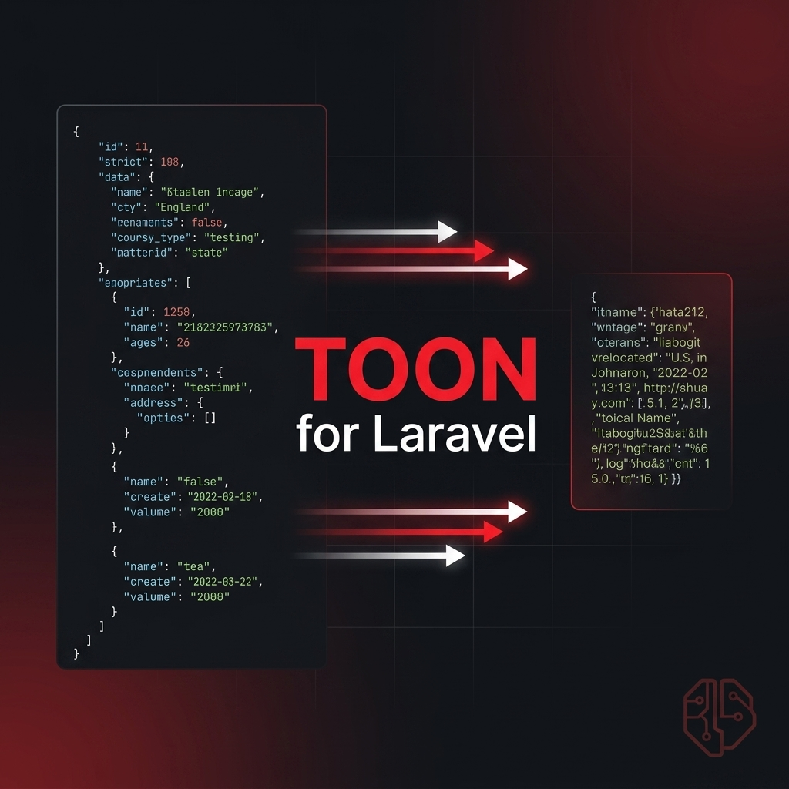
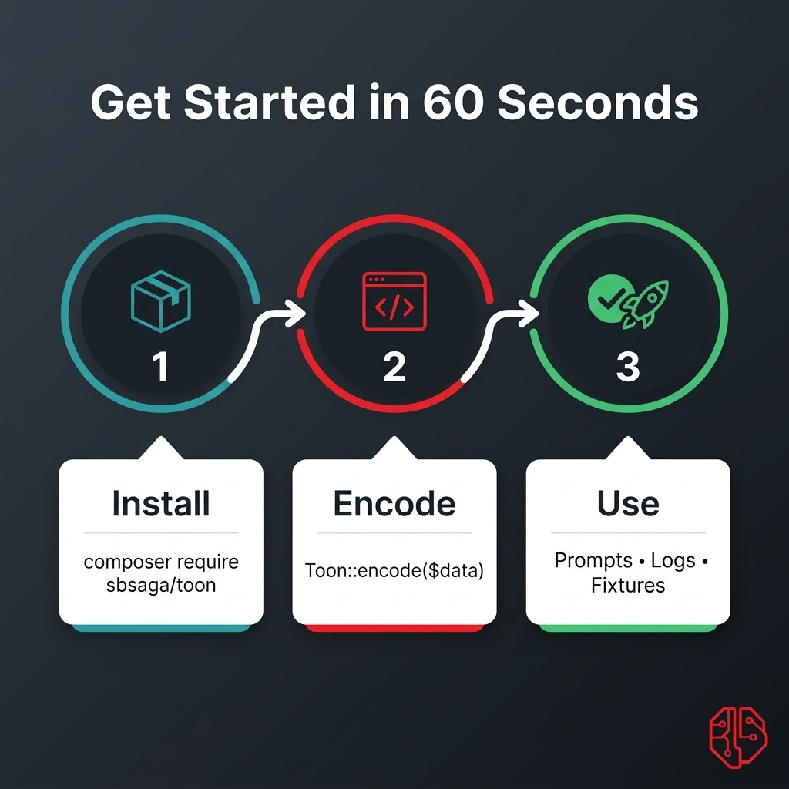
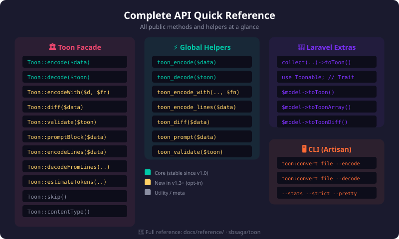

# TOON Documentation

  

This docs set is organized around quick adoption, trustworthy benchmarks, and upgrade safety.

## Choose Your Path

  

If you are new to TOON:

1. [Quickstart](quickstart.md)
2. [Cookbook: real-world examples](cookbook.md)
3. [FAQ](faq.md)

If you are shipping to production:

1. [Production playbook](production-playbook.md)
2. [Migration guide](migration.md)
3. [Troubleshooting](troubleshooting.md)

## Start Here

- [Quickstart](quickstart.md)
- [Cookbook: real-world examples](cookbook.md)
- [Production playbook](production-playbook.md)
- [Upgrade Safety for v1.3.0](upgrade-safety-v1-3.md)
- [CLI Conversion Guide](cli-conversion-guide.md)
- [Replacer Recipes](replacer-recipes.md)
- [Benchmarks](benchmarks.md)
- [Format and Compatibility](spec-compatibility.md)
- [Syntax Cheatsheet](syntax-cheatsheet.md)
- [LLM Integration](llm-integration.md)
- [Media Type and Files](media-type-and-files.md)
- [When Not to Use TOON](when-not-to-use-toon.md)
- [Use Cases](use-cases.md)
- [Migration Guide](migration.md)
- [FAQ](faq.md)
- [Troubleshooting](troubleshooting.md)
- [Reference](reference/README.md)

## Longer-Form Content

- [Article Index](articles/README.md)
- [Introducing TOON for Laravel](articles/introducing-toon-for-laravel.md)

## Examples

- [Examples Index](../examples/README.md)
- [AI prompt compression](../examples/laravel-ai-prompt-compression/README.md)
- [Log payload storage](../examples/laravel-log-payload-storage/README.md)

## Visual Reference

  

  

