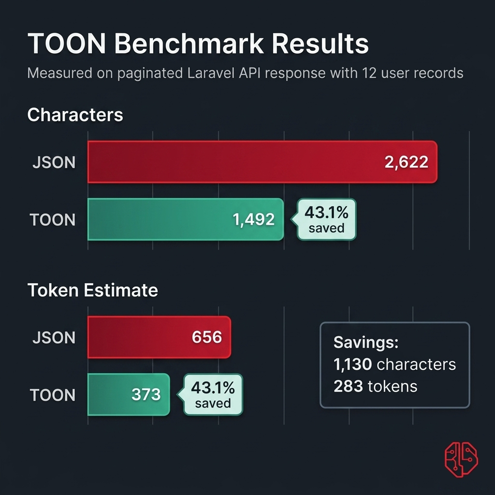

# Benchmarks

<p align="center">
  
</p>

## Benchmark Fixture

This repository includes a reproducible benchmark fixture:

- `benchmarks/fixtures/paginated-users.json`

It models a Laravel-style paginated API response with repeated user fields, pagination metadata, and links.
The data is synthetic and repository-generated so it is safe to reuse in documentation and demos.

## How to Run It

```bash
php benchmarks/run.php benchmarks/fixtures/paginated-users.json
```

## Current Result

Output from the current package version:

```json
{
  "fixture": "benchmarks/fixtures/paginated-users.json",
  "json_chars": 2622,
  "toon_chars": 1492,
  "saved_chars": 1130,
  "savings_percent": 43.1,
  "json_tokens_estimate": 656,
  "toon_tokens_estimate": 373,
  "saved_tokens_estimate": 283
}
```

## Methodology

1. Load the JSON fixture.
2. Decode it into a PHP array.
3. Encode it with `Toon::diff()`.
4. Compare JSON and TOON lengths.
5. Estimate tokens using the package's dependency-free character heuristic.

## Notes

- The included token estimate is for relative comparison, not billing reconciliation.
- Results will vary depending on how repetitive your payload shape is.
- Uniform rows with scalar fields compress best because TOON can render them as compact tables.
- Sample names, emails, and records in the fixture are synthetic.
