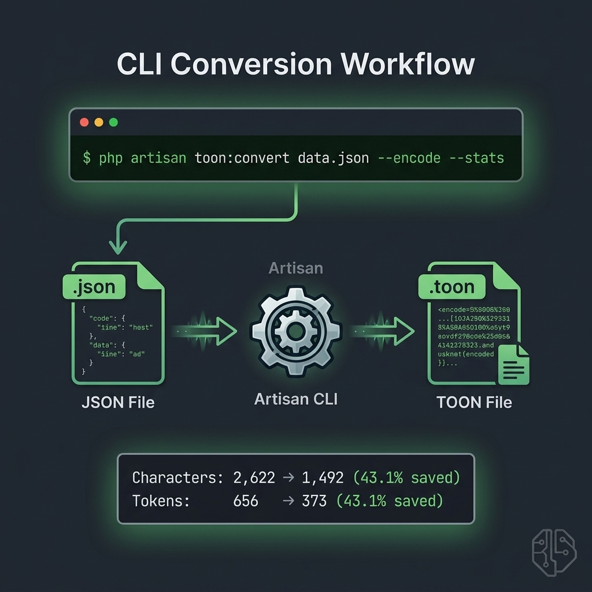

# CLI Conversion Guide

<p align="center">
  
</p>

`toon:convert` supports both legacy usage and newer explicit direction/options.

## Command

```bash
php artisan toon:convert {file?} [options]
```

## Direction Resolution (Precedence)

The command resolves encode/decode direction in this order:

1. `--decode` or `--encode` (highest priority)
2. `--from` and `--to`
3. file extension autodetect (`.json` -> encode, `.toon` -> decode)
4. fallback to decode (legacy-compatible default)

## New Options

- `--from=auto|json|toon`
- `--to=auto|json|toon`
- `--stats` (writes metrics JSON to STDERR)
- `--delimiter=comma|pipe|tab|<char>`
- `--mode=legacy|modern`
- `--strict` (strict table validation when decoding)

## Common Examples

Encode JSON file to TOON:

```bash
php artisan toon:convert storage/app/payload.json --encode
```

Decode TOON to pretty JSON:

```bash
php artisan toon:convert storage/app/payload.toon --decode --pretty
```

Use explicit direction without encode/decode flags:

```bash
php artisan toon:convert storage/app/payload.data --from=json --to=toon
```

Override mode and delimiter for one command only:

```bash
php artisan toon:convert storage/app/payload.json --encode --mode=modern --delimiter=pipe
```

Write stats to STDERR while keeping payload on STDOUT:

```bash
php artisan toon:convert storage/app/payload.json --encode --stats
```

## Compatibility Notes

- Existing scripts using only `--encode` or `--decode` remain valid.
- No default behavior changes were introduced for direction fallback.
- Runtime config overrides via CLI are command-local and do not require editing `config/toon.php`.
