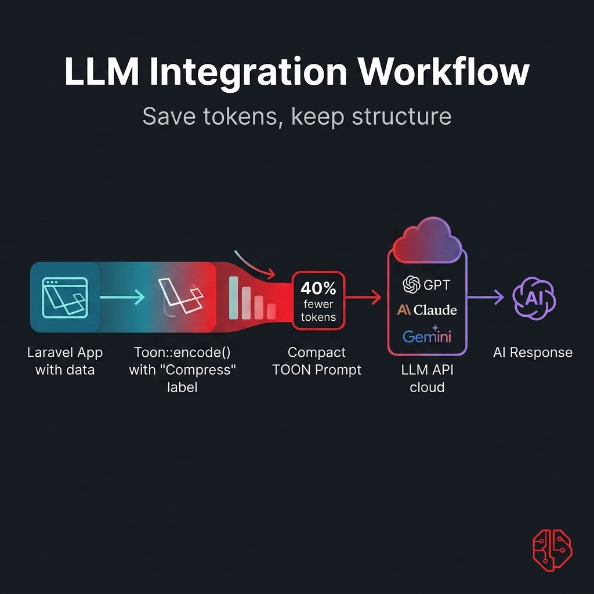
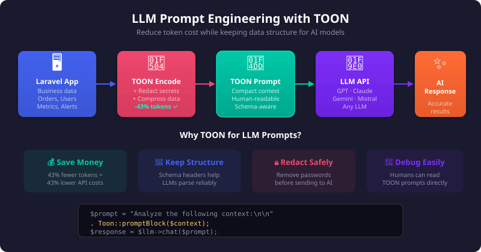

# Using TOON with LLMs

<p align="center">
  
</p>

TOON is a strong fit for LLM workflows because it keeps structured data readable while reducing repeated JSON punctuation and field names.

## Practical Prompt Pattern

<p align="center">
  
</p>

Use TOON as the structured context block instead of pasting raw JSON.

```php
use Sbsaga\Toon\Facades\Toon;

$context = [
    'account' => $account->only(['id', 'name', 'tier']),
    'orders' => $orders->map->only(['id', 'status', 'total'])->all(),
    'alerts' => $alerts->map->only(['severity', 'message'])->all(),
];

$prompt = <<<PROMPT
Review the following business context and produce a summary:

%s
PROMPT;

$response = $llm->chat(sprintf($prompt, Toon::promptBlock($context)));
```

## Validating Model Output

If you ask a model to return TOON, validate it before trusting it:

```php
$result = Toon::validate($modelOutput, strict: true);

if (!$result['valid']) {
    // Ask the model to regenerate or fall back to JSON handling.
}
```

## Delimiter Tip

The wider TOON ecosystem recommends tab delimiters when maximum compactness matters. This package supports opt-in delimiter changes through `config/toon.php`.

```php
'delimiter' => 'tab',
```

## Safe Rollout Advice

For existing projects, keep `compatibility_mode` on `legacy` unless you are intentionally migrating consumers to the newer nested-data behavior.
