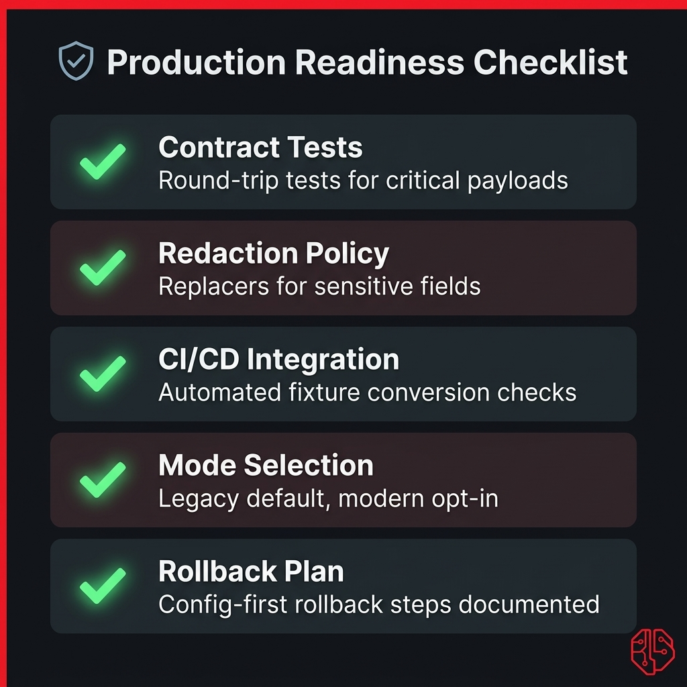
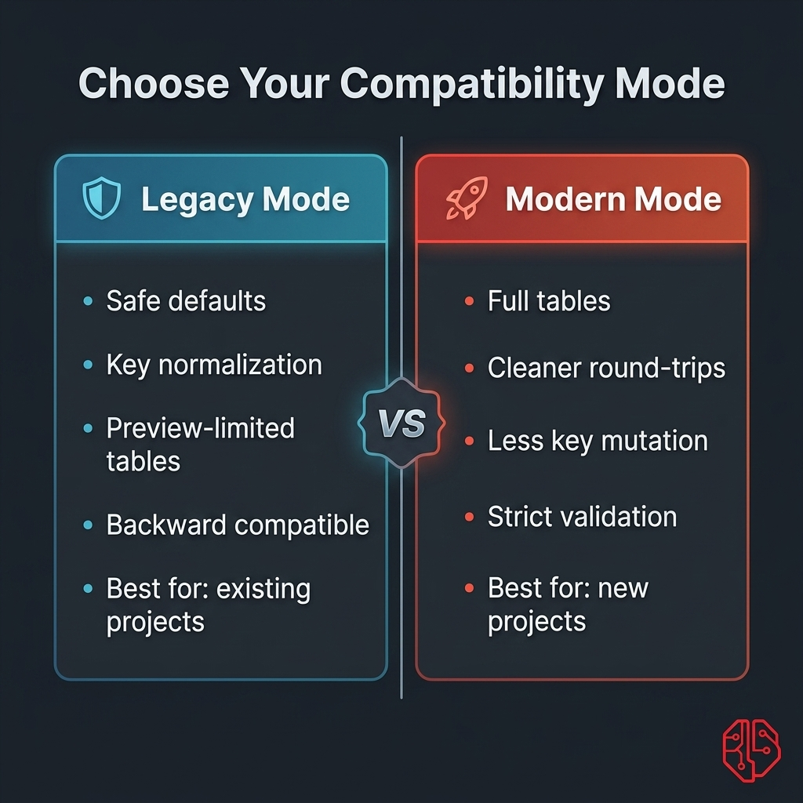

# Production Playbook

<p align="center">
  
</p>

This guide is for teams shipping TOON in real applications with low risk.

## Goals

- keep upgrades backward-compatible
- avoid leaking sensitive data into logs/prompts
- make behavior predictable across environments
- give teams a clear rollback path

## Baseline Configuration

Start with safe defaults:

```php
// config/toon.php
return [
    'compatibility_mode' => 'legacy',
    'strict_mode' => false,
    'delimiter' => 'comma',
    'coerce_scalar_types' => true,
];
```

Recommended environment strategy:

- `production`: `legacy` mode first
- `staging`: trial `modern` mode with contract tests
- `local/dev`: free to experiment with mode/delimiter

## Rollout Strategy

<p align="center">
  
</p>

1. Upgrade package and keep `legacy`.
2. Add snapshot tests for high-impact payloads.
3. Add redaction replacers for sensitive fields.
4. Enable strict decode only where malformed data must fail.
5. Trial `modern` mode in staging.
6. Promote to production after downstream validation.

## Contract Testing Pattern

Create a payload fixture and verify both directions:

```php
use PHPUnit\Framework\TestCase;
use Sbsaga\Toon\Facades\Toon;

final class ToonContractTest extends TestCase
{
    public function testCriticalPayloadRoundTrip(): void
    {
        $payload = [
            'order' => ['id' => 101, 'status' => 'paid'],
            'items' => [
                ['sku' => 'A1', 'qty' => 2],
                ['sku' => 'B9', 'qty' => 1],
            ],
        ];

        $toon = Toon::encode($payload);
        $decoded = Toon::decode($toon);

        $this->assertSame('paid', $decoded['order']['status']);
        $this->assertSame('A1', $decoded['items'][0]['sku']);
    }
}
```

## Redaction Standard

Define one reusable replacer for security-sensitive logs/prompts.

```php
use Sbsaga\Toon\Facades\Toon;

function safeToon(array $payload): string
{
    return Toon::encodeWith($payload, function (array $path, string|int|null $key, mixed $value) {
        if (in_array($key, ['password', 'token', 'secret', 'api_key'], true)) {
            return Toon::skip();
        }

        if ($key === 'email') {
            return '[redacted]';
        }

        return $value;
    });
}
```

## Monitoring and Validation

Measure, do not assume:

- compare JSON vs TOON with `Toon::diff()`
- track decode failures if strict mode is enabled
- track payload size changes over time for critical flows

Simple metric logging example:

```php
$report = \Sbsaga\Toon\Facades\Toon::diff($payload);
logger()->info('toon.diff', $report);
```

## CLI in CI/CD

Examples for automation:

```bash
# Convert fixture JSON into TOON
php artisan toon:convert tests/fixtures/invoice.json --encode --output=tests/fixtures/invoice.toon

# Validate decode with strict checks
php artisan toon:convert tests/fixtures/invoice.toon --decode --strict --pretty

# Emit conversion stats for CI logs
php artisan toon:convert tests/fixtures/invoice.json --encode --stats
```

## Incident and Rollback Plan

If downstream parsers fail after upgrade:

1. keep package version and force `compatibility_mode=legacy`
2. disable any newly introduced custom replacer transform
3. disable strict decode on non-critical paths
4. re-run contract tests and compare output with previous snapshots

Because TOON default mode remains `legacy`, rollback usually requires configuration change first, not code removal.

## Definition of Done for Production Adoption

- high-impact payloads covered by tests
- sensitive fields redacted by policy
- CI conversion checks added for critical fixtures
- clear ownership for mode/delimiter policy
- one-click rollback steps documented in runbooks
