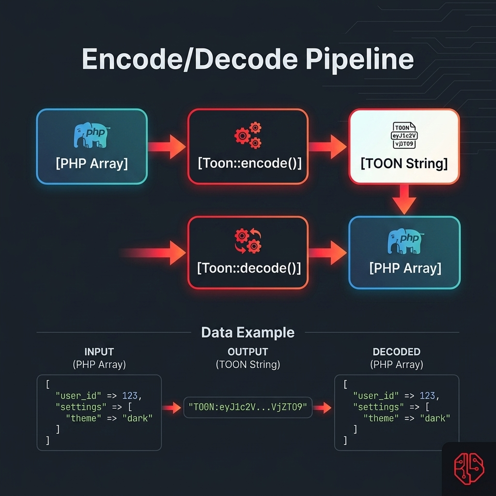

# Quickstart

<p align="center">
  
</p>

This page helps you get from zero to production-ready usage quickly.

## Who This Is For

Use TOON when you want structured data that is:

- smaller and easier to read than JSON
- still reversible back into arrays with `decode()`
- useful for prompts, logs, fixtures, and internal review flows

If your use case is external API transport, JSON should still be your default.

## Install

```bash
composer require sbsaga/toon
```

Laravel package discovery registers provider and facade automatically.

Optional: publish config.

```bash
php artisan vendor:publish --provider="Sbsaga\Toon\ToonServiceProvider" --tag=config
```

## First Success in 2 Minutes

Drop this in a route or tinker session:

```php
use Illuminate\Support\Facades\Route;
use Sbsaga\Toon\Facades\Toon;

Route::get('/toon-demo', function () {
    $payload = [
        'project' => 'TOON',
        'users' => [
            ['id' => 1, 'name' => 'Alice', 'active' => true],
            ['id' => 2, 'name' => 'Bob', 'active' => false],
        ],
    ];

    $encoded = Toon::encode($payload);
    $decoded = Toon::decode($encoded);

    return response()->json([
        'toon' => $encoded,
        'decoded' => $decoded,
    ]);
});
```

## What the Output Means

Typical encoded output:

```text
project: TOON
users:
  items[2]{id,name,active}:
    1,Alice,true
    2,Bob,false
```

How to read it:

- `project: TOON` is a simple key/value pair
- `users:` starts a nested block
- `items[2]{...}` is a table with 2 rows and named columns
- each row contains the values for that column order

## Core API You Need First

<p align="center">
  
</p>

```php
use Sbsaga\Toon\Facades\Toon;

$toon = Toon::encode($payload);          // array/json/scalar -> TOON string
$data = Toon::decode($toon);             // TOON string -> array
$stats = Toon::estimateTokens($toon);    // quick rough token estimate
$diff = Toon::diff($payload);            // JSON-vs-TOON size comparison
```

Global helpers are also available:

```php
$toon = toon_encode($payload);
$data = toon_decode($toon);
$diff = toon_diff($payload);
```

## Safe Defaults and Compatibility

Default mode is `legacy`, which keeps old behavior safer for existing users.

```php
// config/toon.php
'compatibility_mode' => 'legacy',
```

Use `modern` for new projects or controlled migrations:

```php
// config/toon.php
'compatibility_mode' => 'modern',
```

## Production Pattern: Redact Before Encoding

Use replacers to remove sensitive fields before TOON encoding.

```php
use Sbsaga\Toon\Facades\Toon;

$safeToon = Toon::encodeWith($payload, function (array $path, string|int|null $key, mixed $value) {
    if (in_array($key, ['password', 'token', 'api_key'], true)) {
        return Toon::skip();
    }

    if ($key === 'email') {
        return '[redacted]';
    }

    return $value;
});
```

Helper version:

```php
$safeToon = toon_encode_with($payload, function (array $path, string|int|null $key, mixed $value) {
    return $key === 'debug' ? \Sbsaga\Toon\Toon::skip() : $value;
});
```

## Production Pattern: Stream-Oriented Usage

If you want line-based processing:

```php
use Sbsaga\Toon\Facades\Toon;

$lines = Toon::encodeLines($payload);        // Generator<string>
$decoded = Toon::decodeFromLines($lines);    // array
```

Helper:

```php
$lines = toon_encode_lines($payload); // array of lines
```

## CLI Usage for Teams and Pipelines

Basic encode/decode:

```bash
php artisan toon:convert storage/app/payload.json --encode
php artisan toon:convert storage/app/payload.toon --decode --pretty
```

Explicit direction and stats:

```bash
php artisan toon:convert storage/app/payload.data --from=json --to=toon --stats
```

One-off runtime overrides:

```bash
php artisan toon:convert storage/app/payload.json --encode --mode=modern --delimiter=pipe
```

Strict validation for decode:

```bash
php artisan toon:convert storage/app/payload.toon --decode --strict
```

## Production Readiness Checklist

1. Keep `compatibility_mode=legacy` for initial upgrade rollout.
2. Add at least one encode/decode round-trip test for your critical payloads.
3. Add a replacer for sensitive fields before logs/prompts.
4. Enable strict decoding where malformed input must fail fast.
5. Roll modern mode only after downstream consumers are verified.

## Common Mistakes to Avoid

- Using TOON as a direct replacement for public API JSON payloads
- Enabling modern mode in production without contract checks
- Logging raw sensitive payloads without replacer redaction
- Assuming token savings for very small payloads without measuring

## Next Guides

- [Upgrade safety for v1.3.0](upgrade-safety-v1-3.md)
- [Production playbook](production-playbook.md)
- [Cookbook: real-world examples](cookbook.md)
- [Troubleshooting](troubleshooting.md)
- [CLI conversion guide](cli-conversion-guide.md)
- [Replacer recipes](replacer-recipes.md)
- [Format and compatibility](spec-compatibility.md)
