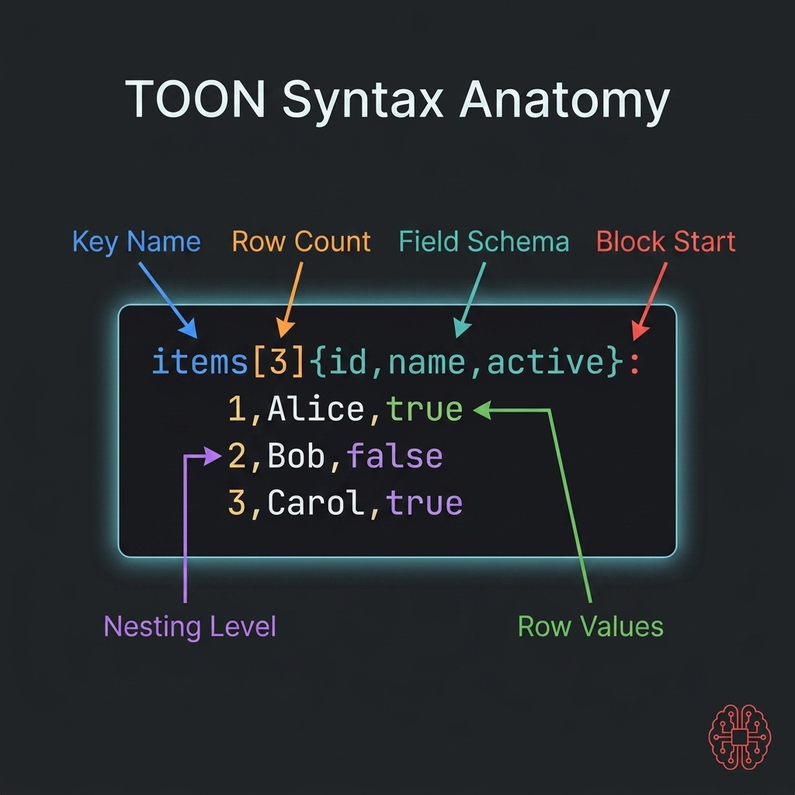

# Syntax Cheatsheet

<p align="center">
  
</p>

This cheatsheet reflects the syntax supported by this Laravel package.

## Key Value Pairs

```text
name: Alice
active: true
count: 12
```

## Nested Objects

```text
user:
  id: 1
  name: Alice
```

## Scalar Lists

```text
admin
editor
viewer
```

## Uniform Object Tables

```text
items[2]{id,name,active}:
  1,Alice,true
  2,Bob,false
```

## Modern Mode for Nested Rows

In `modern` mode, complex list items are expanded instead of being flattened into lossy table cells.

```text
users:
  -
    id: 1
    meta:
      x: 1
  -
    id: 2
    meta:
      x: 2
```

## Validation

```php
$result = Toon::validate($toon, strict: true);
```

## Prompt Blocks

```php
$markdown = Toon::promptBlock($payload);
```
