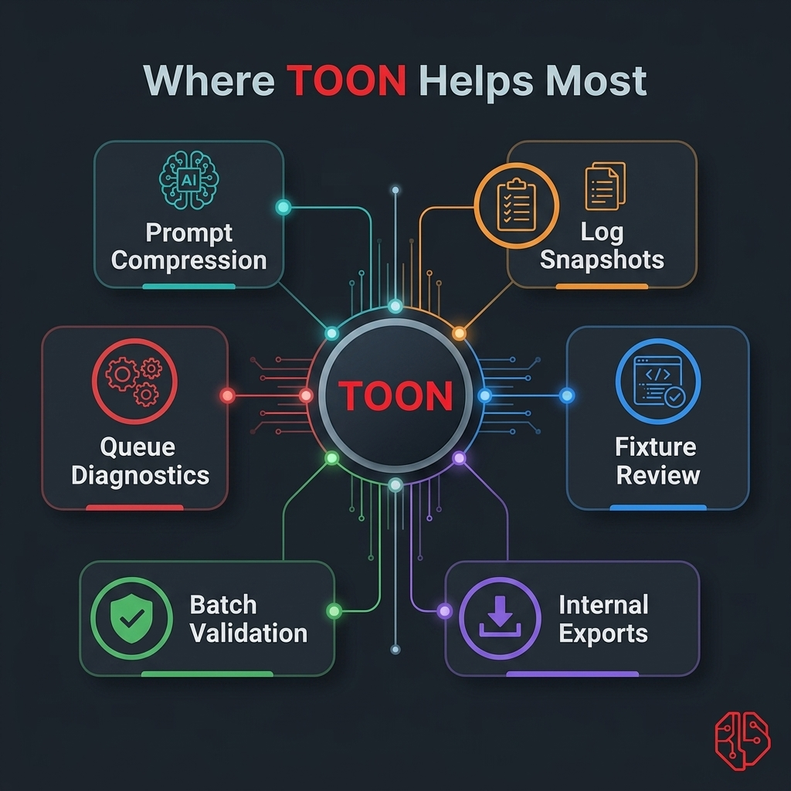

# Use Cases

<p align="center">
  
</p>

This page explains where TOON helps most in production Laravel systems.

## 1) Prompt Context Compression

Problem:

- business objects become expensive/noisy when inserted into LLM prompts as raw JSON

Pattern:

```php
use Sbsaga\Toon\Facades\Toon;

$context = [
    'customer' => $customer->only(['id', 'name', 'tier']),
    'orders' => $orders->map->only(['id', 'status', 'total'])->all(),
];

$prompt = "Review the context below and suggest next action.\n\n"
    . Toon::promptBlock($context);
```

Why this works:

- repeated keys are reduced in table-style sections
- prompt remains human-readable for debugging

## 2) Redacted Log Snapshots

Problem:

- raw JSON logs are verbose and can expose sensitive fields

Pattern:

```php
use Illuminate\Support\Facades\Log;
use Sbsaga\Toon\Facades\Toon;

$safe = Toon::encodeWith($payload, function (array $path, string|int|null $key, mixed $value) {
    if (in_array($key, ['password', 'token', 'secret'], true)) {
        return Toon::skip();
    }

    return $value;
});

Log::info('webhook.snapshot', ['toon' => $safe]);
```

Why this works:

- keeps payload reviewable during incidents
- prevents accidental plaintext secret logging

## 3) Fixture Review and Version Control

Problem:

- large JSON fixtures are harder to scan in pull requests

Pattern:

```bash
php artisan toon:convert tests/fixtures/orders.json --encode --output=tests/fixtures/orders.toon
```

Why this works:

- diffs are shorter for repeated row structures
- reviewers can focus on changed values faster

## 4) Internal Export Endpoints

Problem:

- teams need compact, readable internal exports without designing custom CSV schemas

Pattern:

```php
use Sbsaga\Toon\Facades\Toon;

return response(Toon::encode($payload), 200)
    ->header('Content-Type', Toon::contentType());
```

Why this works:

- easier than hand-rolling text formats
- reversible through `decode()`

## 5) Batch Import Validation

Problem:

- malformed structured text should fail before touching domain logic

Pattern:

```php
use Sbsaga\Toon\Facades\Toon;

$raw = file_get_contents(storage_path('app/imports/data.toon'));
$result = Toon::validate($raw, true);

if (!$result['valid']) {
    throw new RuntimeException($result['error'] ?? 'Invalid TOON');
}

$data = Toon::decode($raw);
```

Why this works:

- strict mode catches table count/shape issues early
- decode happens only after validation passes

## 6) Queue and Job Diagnostics

Problem:

- when jobs fail, raw context can be huge and difficult to inspect

Pattern:

```php
use Sbsaga\Toon\Facades\Toon;

logger()->warning('billing.job.failed', [
    'job' => $jobId,
    'context_toon' => Toon::encodeWith($context, fn (array $path, string|int|null $key, mixed $value) => $value),
]);
```

Why this works:

- snapshot remains compact
- debugging improves without custom serializers

## Decision Rule

Choose TOON when:

- internal humans read payloads frequently
- field repetition is high
- prompt token budget matters

Choose JSON when:

- external interoperability is primary
- strict JSON schema tooling is required
- public API contracts depend on JSON
