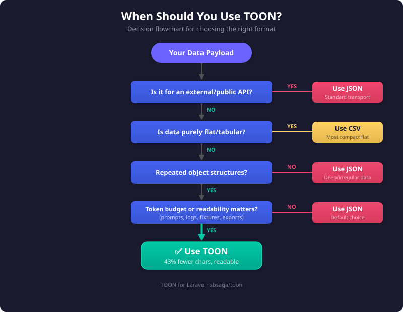
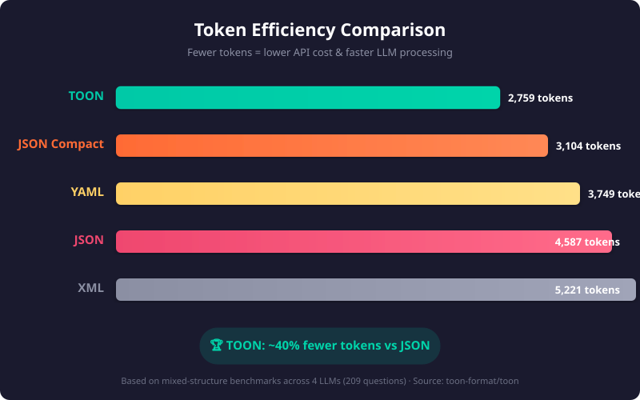

# When Not to Use TOON

  

TOON is useful, but it should not replace JSON everywhere.

## Format Comparison

  

## Prefer JSON When

- the data is deeply nested and highly irregular
- you need a standard network transport format
- downstream tools already depend heavily on JSON parsing
- the payload is very small and readability gains are minimal

## Prefer CSV When

- the data is purely tabular and you do not need nested structure

## Why This Matters

The official TOON ecosystem guidance also notes that deeply nested or non-uniform structures may not always deliver the best token savings. This package is strongest when repeated rows share a stable shape.
